# PageIndex Framework: VectifyAI

> **Referensi**: VectifyAI (2024). PageIndex: Vectorless, Reasoning-based RAG.
> **Repository**: [github.com/VectifyAI/PageIndex](https://github.com/VectifyAI/PageIndex)

---

## Daftar Isi

1. [Gambaran Umum](#1-gambaran-umum)
2. [Arsitektur Kode](#2-arsitektur-kode)
3. [Phase 1: Indexing Pipeline](#3-phase-1-indexing-pipeline-detail)
   - 3.1 Entry Point
   - 3.2 Adaptive 3-Mode TOC Detection
   - 3.3 Verification & Self-Correction
   - 3.4 Recursive Node Subdivision
   - 3.5 Post-Processing
   - 3.6 Preface Handling
4. [Phase 2: Retrieval (Tree Search)](#4-phase-2-retrieval-tree-search)
5. [Multi-Document Search](#5-multi-document-search)
6. [Konfigurasi Default](#6-konfigurasi-default)
7. [Output Format](#7-output-format)
8. [Jumlah LLM Calls di Indexing](#8-jumlah-llm-calls-di-indexing)
9. [Utility Functions Penting](#9-utility-functions-penting)
10. [Markdown Support](#10-markdown-support-page_index_mdpy)
11. [Relevansi untuk Skripsi](#11-relevansi-untuk-skripsi)
12. [Catatan Teknis Tambahan](#12-catatan-teknis-tambahan)
13. [Referensi Terkait](#13-referensi-terkait)

---

## 1. Gambaran Umum

PageIndex adalah framework **RAG (Retrieval-Augmented Generation) tanpa vektor** yang menggunakan **reasoning LLM** untuk retrieval, bukan similarity search berbasis embedding. Terinspirasi dari AlphaGo, sistem ini membangun **hierarchical tree index** dari dokumen panjang dan menggunakan LLM untuk **menavigasi tree** secara agentic.

### Premis Utama

> **Similarity ≠ Relevance**. Vector-based RAG mengandalkan kemiripan semantik, tetapi yang dibutuhkan untuk retrieval profesional adalah **relevansi**, dan relevansi membutuhkan **reasoning**.

### Dua Fase Kerja

| Fase | Nama | Deskripsi |
|------|------|-----------|
| 1 | **Indexing** | Transformasi dokumen PDF → hierarchical tree structure (mirip Table of Contents, tapi dioptimasi untuk LLM) |
| 2 | **Retrieval** | LLM melakukan tree search berbasis reasoning untuk menemukan node yang paling relevan dengan query |

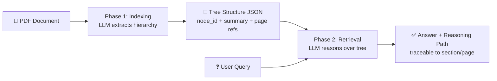

### Keunggulan vs Vector-based RAG

| Aspek | Vector RAG | PageIndex |
|-------|-----------|-----------|
| Storage | Membutuhkan Vector DB | Cukup JSON tree structure |
| Chunking | Dokumen dipotong jadi chunks artifisial | Dokumen diorganisir per section natural |
| Retrieval | Similarity search (approximate) | Reasoning-based (interpretable) |
| Explainability | Black-box ("vibe retrieval") | Traceable — ada page/section reference |
| Domain knowledge | Butuh fine-tune embedding | Cukup tambahkan ke prompt |

### Klaim Performa

PageIndex mengklaim **98.7% akurasi** pada FinanceBench (via Mafin2.5), melampaui solusi RAG berbasis vektor.

---

### Inspirasi: AlphaGo & MCTS

PageIndex terinspirasi dari **AlphaGo** — program AI buatan DeepMind (Google) yang mengalahkan juara dunia permainan Go (棋) pada 2016.

**Kenapa Go itu susah?**
Go adalah permainan papan 19×19 dengan jumlah kemungkinan posisi lebih besar dari jumlah atom di alam semesta (~10^170). Brute-force search seperti chess tidak mungkin dilakukan.

**Inovasi AlphaGo: MCTS + Neural Network**

AlphaGo menggabungkan tiga komponen:
- **Policy Network** — "langkah mana yang *kira-kira* bagus?" (pruning: tidak perlu explore semua kemungkinan)
- **Value Network** — "dari posisi ini, siapa yang *kemungkinan* menang?"
- **Monte Carlo Tree Search (MCTS)** — tree traversal yang *dipandu* kedua network di atas

MCTS bekerja secara iteratif:
1. **Select** → pilih node yang paling "menjanjikan" berdasarkan UCB score
2. **Expand** → buka node baru
3. **Simulate** → main sampai akhir (rollout)
4. **Backpropagate** → update nilai node dari bawah ke atas

**Hubungannya dengan PageIndex**

| AlphaGo | PageIndex |
|---------|-----------|
| Papan Go = tree of possible moves | Dokumen = hierarchical tree of sections |
| Tidak bisa explore semua moves | Tidak bisa masukkan semua teks ke LLM sekaligus |
| MCTS + heuristic untuk navigate tree | LLM reasoning untuk navigate section tree |
| Goal: temukan move terbaik | Goal: temukan section paling relevan |

Intinya: **gunakan reasoning/heuristic untuk navigate tree secara efisien**, bukan brute-force baca semua konten. Itulah mengapa PageIndex menyebut retrieval-nya sebagai "human-like" — manusia juga tidak membaca buku dari halaman 1 sampai akhir, tapi langsung ke daftar isi → bab relevan → cari jawabannya.

> **Catatan**: Versi open-source PageIndex menggunakan basic LLM tree search. Versi production (dashboard) menggunakan MCTS penuh dengan value function berbasis LLM, tapi detail implementasinya belum di-open-source.

---

## 2. Arsitektur Kode

### Struktur File

```
PageIndex/
├── run_pageindex.py          # Entry point CLI
├── requirements.txt          # Dependencies
├── pageindex/
│   ├── __init__.py           # Exports page_index_main, md_to_tree
│   ├── config.yaml           # Default configuration
│   ├── page_index.py         # Core indexing pipeline (1144 baris)
│   ├── page_index_md.py      # Markdown-specific indexing (339 baris)
│   └── utils.py              # Utilities: LLM API, PDF parsing, tree ops (712 baris)
├── tutorials/
│   ├── tree-search/          # Tutorial retrieval via tree search
│   └── doc-search/           # Tutorial multi-document search (3 strategi)
├── cookbook/                  # Jupyter notebooks: RAG demo, vision RAG, chat
└── tests/
    ├── pdfs/                 # Sample PDF documents
    └── results/              # Generated tree structures (JSON)
```

### Dependency Stack

- **OpenAI API** (`openai`) — LLM backbone (default: `gpt-4o-2024-11-20`)
- **PyPDF2** + **PyMuPDF** (`pymupdf`) — PDF text extraction
- **tiktoken** — Token counting untuk model OpenAI
- **python-dotenv** — Environment variable management

---

## 3. Phase 1: Indexing Pipeline (Detail)

### 3.0 Indexing Pipeline — Mermaid Flowchart Lengkap

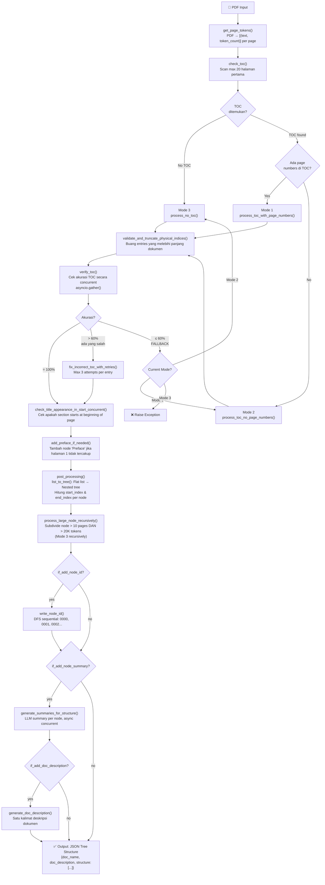

### 3.1 Entry Point

```python
# run_pageindex.py
page_index_main(pdf_path, opt)  # → returns JSON tree structure
```

Fungsi `page_index_main()` di `page_index.py` (line 1077-1128) adalah orchestrator utama:

1. Parse PDF → `page_list` = `[(page_text, token_count), ...]`
2. Jalankan `tree_parser()` secara async
3. Post-process: tambah `node_id`, `summary`, `doc_description`
4. Return JSON structure

### 3.2 Adaptive 3-Mode TOC Detection

Inti kecanggihan PageIndex ada di deteksi TOC adaptif. Fungsi `tree_parser()` secara otomatis memilih mode berdasarkan apa yang ditemukan di dokumen:

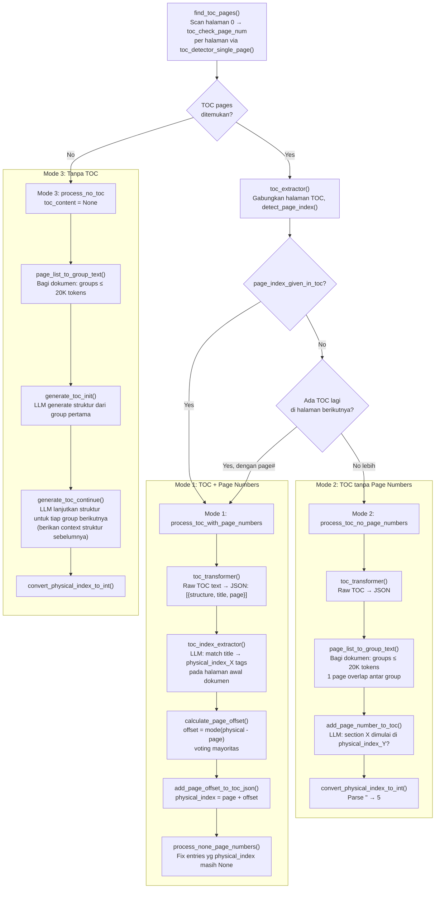

#### Mode 1: `process_toc_with_page_numbers`

**Kondisi**: Dokumen punya TOC dan TOC berisi page numbers.

**Alur**:
1. `toc_transformer()` — LLM convert raw TOC → JSON flat list
2. `toc_index_extractor()` — LLM cocokkan TOC entries ke physical pages di awal dokumen
3. `calculate_page_offset()` — Hitung offset antara logical page (dari TOC) dan physical page (posisi sebenarnya di PDF), menggunakan voting mayoritas dari pasangan yang cocok
4. `add_page_offset_to_toc_json()` — Terapkan offset ke semua entries
5. `process_none_page_numbers()` — Fix entries yang masih None

**Contoh offset**: TOC bilang "Chapter 1 ... page 5", tapi di PDF halaman tersebut ada di physical page 7. Offset = 2.

#### Mode 2: `process_toc_no_page_numbers`

**Kondisi**: Dokumen punya TOC tapi tanpa page numbers.

**Alur**:
1. `toc_transformer()` — LLM convert raw TOC → JSON
2. Bagi seluruh dokumen jadi groups (max 20K tokens per group, dengan 1 page overlap)
3. Untuk setiap group, `add_page_number_to_toc()` — LLM cocokkan section titles ke `<physical_index_X>` tags
4. `convert_physical_index_to_int()` — Parse string tags ke integer

#### Mode 3: `process_no_toc`

**Kondisi**: Dokumen tanpa TOC sama sekali.

**Alur**:
1. Bagi seluruh dokumen jadi groups (max 20K tokens per group)
2. `generate_toc_init()` — LLM generate structure dari group pertama
3. `generate_toc_continue()` — LLM lanjutkan structure untuk group berikutnya, dengan konteks structure sebelumnya
4. `convert_physical_index_to_int()` — Parse tags ke integer

### 3.3 Verification & Self-Correction

Setelah TOC berhasil di-generate, PageIndex melakukan **verifikasi dan perbaikan otomatis**:

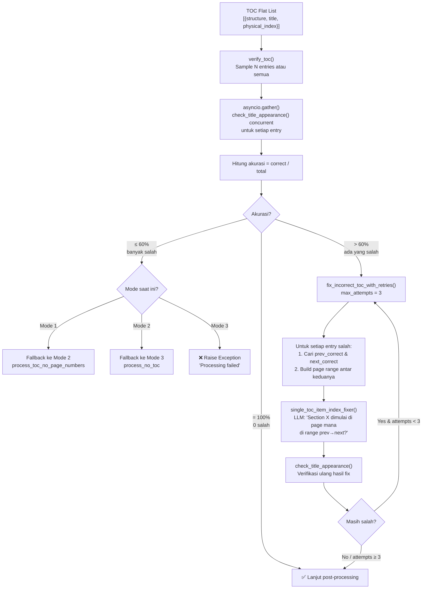

#### Verifikasi (`verify_toc`)

Untuk setiap entry, LLM mengecek:
> "Apakah section title X benar-benar muncul/dimulai di physical page Y?"

Prompt yang digunakan (simplified):
```
Check if the given section appears or starts in the given page_text.
Section title: {title}
Page text: {page_text}
Answer: yes/no
```

Semua pengecekan berjalan **concurrent** via `asyncio.gather()`.

#### Self-Correction (`fix_incorrect_toc_with_retries`)

```
Akurasi = jumlah_benar / jumlah_dicek

if akurasi == 100%:     → selesai
elif akurasi > 60%:     → fix yang salah (max 3 attempts)
elif akurasi ≤ 60%:     → fallback ke mode yang lebih rendah
```

**Fallback cascade**:
```
Mode 1 (TOC + page#) gagal → Mode 2 (TOC only) gagal → Mode 3 (no TOC)
```

Untuk setiap entry yang salah, `single_toc_item_index_fixer()`:
1. Tentukan range pencarian: dari `prev_correct_physical_index` sampai `next_correct_physical_index`
2. LLM cari di range tersebut halaman mana yang benar
3. Verifikasi ulang hasil perbaikan
4. Jika masih salah setelah 3 attempts → tetap simpan (best effort)

### 3.4 Recursive Node Subdivision

Setelah tree terbentuk, node yang terlalu besar di-subdivide:

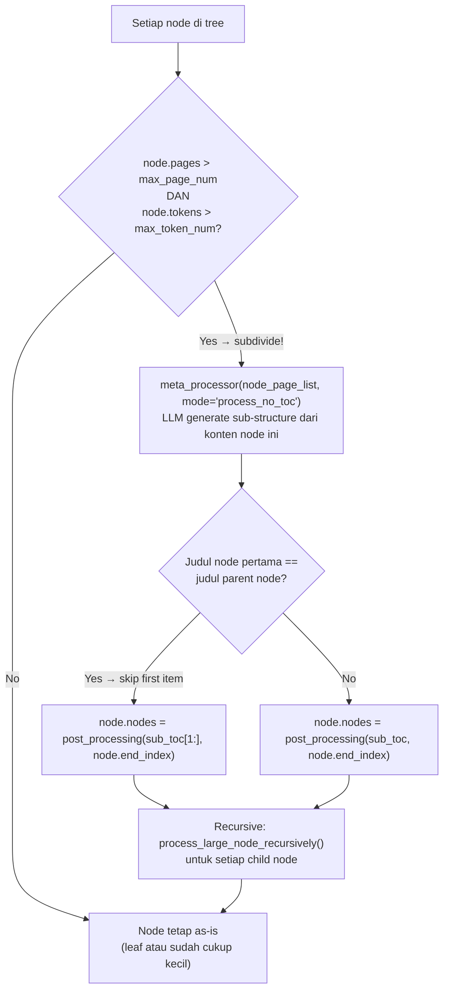

```python
# Threshold dari config:
max_page_num_each_node = 10    # lebih dari 10 halaman
max_token_num_each_node = 20000  # dan lebih dari 20K tokens

# Jika keduanya terpenuhi → subdivide
process_large_node_recursively(node, page_list, opt)
```

Subdivide menggunakan **Mode 3 (process_no_toc)** secara rekursif — LLM generate sub-structure dari teks node tersebut.

### 3.5 Post-Processing

#### Flat List → Nested Tree (`list_to_tree`)

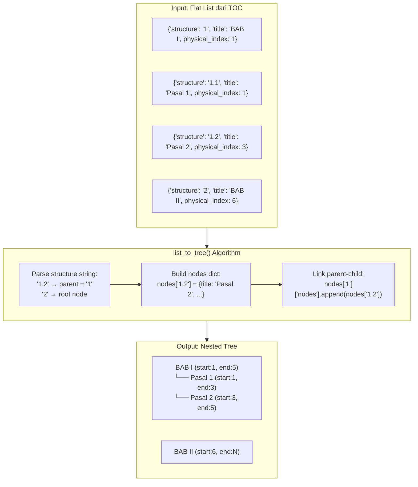

Input flat list:
```json
[
  {"structure": "1", "title": "BAB I", "start_index": 1, "end_index": 5},
  {"structure": "1.1", "title": "Section A", "start_index": 1, "end_index": 3},
  {"structure": "1.2", "title": "Section B", "start_index": 3, "end_index": 5},
  {"structure": "2", "title": "BAB II", "start_index": 5, "end_index": 10}
]
```

Output nested tree:
```json
[
  {
    "title": "BAB I", "start_index": 1, "end_index": 5,
    "nodes": [
      {"title": "Section A", "start_index": 1, "end_index": 3},
      {"title": "Section B", "start_index": 3, "end_index": 5}
    ]
  },
  {"title": "BAB II", "start_index": 5, "end_index": 10}
]
```

Konversi menggunakan `structure` string ("1.2.3") untuk menentukan parent-child relationship.

#### Start/End Index Calculation (`post_processing`)

`start_index` = `physical_index` entry saat ini.  
`end_index` ditentukan dari entry berikutnya:
- Jika section berikutnya **dimulai di awal halaman** (`appear_start == "yes"`): `end_index = next.physical_index - 1`
- Jika tidak: `end_index = next.physical_index` (halaman di-share)

#### Node ID Assignment (`write_node_id`)

DFS traversal, sequential numbering: `"0000"`, `"0001"`, `"0002"`, ...

#### Summary Generation (`generate_summaries_for_structure`)

Setiap node mendapat LLM-generated summary dari teksnya. Semua summary di-generate secara **concurrent**.

Prompt:
```
Generate a description of the partial document about what are the main points
covered in the partial document.
```

#### Document Description (`generate_doc_description`)

Satu kalimat deskripsi dokumen dari keseluruhan tree structure (tanpa raw text, hanya title + summary).

Prompt:
```
Generate a one-sentence description for the document, which makes it easy to
distinguish the document from other documents.
```

### 3.6 Preface Handling

Jika section pertama tidak dimulai dari halaman 1, otomatis ditambahkan node "Preface":
```python
if data[0]['physical_index'] > 1:
    data.insert(0, {"structure": "0", "title": "Preface", "physical_index": 1})
```

---

## 4. Phase 2: Retrieval (Tree Search)

### 4.0 Retrieval Flow — Mermaid Sequence Diagram

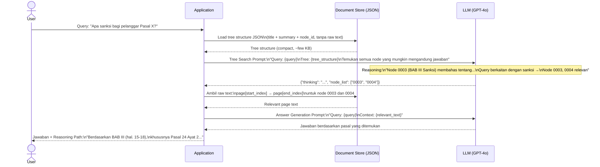

### 4.1 Basic LLM Tree Search

Dari tutorial, strategi retrieval paling sederhana:

```python
prompt = f"""
You are given a query and the tree structure of a document.
You need to find all nodes that are likely to contain the answer.

Query: {query}
Document tree structure: {PageIndex_Tree}

Reply in JSON format:
{{
  "thinking": <reasoning about which nodes are relevant>,
  "node_list": [node_id1, node_id2, ...]
}}
"""
```

LLM menerima **seluruh tree** (tanpa raw text, hanya title + summary + node_id) dan memilih node mana yang relevan.

### 4.2 Enhanced Tree Search dengan Expert Knowledge

```python
prompt = f"""
Query: {query}
Document tree structure: {PageIndex_Tree}
Expert Knowledge of relevant sections: {Preference}

Reply: {{ "thinking": ..., "node_list": [...] }}
"""
```

Contoh expert preference:
> "If the query mentions EBITDA adjustments, prioritize Item 7 (MD&A) and footnotes in Item 8 (Financial Statements) in 10-K reports."

**Keunggulan vs vector RAG**: Tidak perlu fine-tune embedding model — cukup tambahkan knowledge ke prompt.

### 4.3 Advanced: MCTS (Monte Carlo Tree Search)

Disebutkan di dokumentasi bahwa versi production menggunakan **value function-based MCTS**, tetapi detail implementasi belum di-open-source.

### 4.4 Setelah Node Ditemukan

Setelah tree search mengembalikan `node_list`, teks dari node-node tersebut (`start_index` → `end_index`) diambil dan dimasukkan ke context window LLM untuk menjawab query.

---

## 5. Multi-Document Search

PageIndex di-design untuk single-document retrieval. Untuk multi-document, tersedia 3 strategi doc-level search:

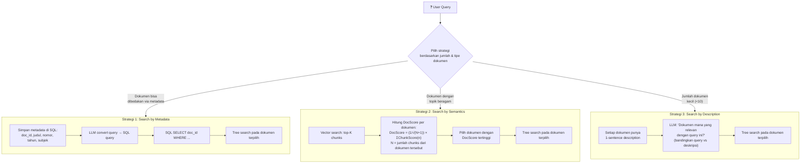

### 5.1 Search by Metadata

Untuk dokumen yang bisa dibedakan via metadata (e.g. financial reports per perusahaan/tahun):
1. Simpan metadata + `doc_id` di database SQL
2. LLM convert user query → SQL query
3. Retrieve dokumen via SQL, lalu lakukan tree search

### 5.2 Search by Semantics

Untuk dokumen dengan topik beragam:
1. Chunking + embedding dokumen (vector DB)
2. Vector search → top-K chunks + associated `doc_id`
3. Hitung **DocScore** per dokumen:

$$
\text{DocScore} = \frac{1}{\sqrt{N+1}} \sum_{n=1}^{N} \text{ChunkScore}(n)
$$

- $N$ = jumlah chunks dari dokumen tersebut
- $\sqrt{N+1}$ mencegah dokumen besar mendominasi hanya karena kuantitas
- Favors dokumen dengan sedikit chunks tapi sangat relevan

4. Pilih dokumen dengan DocScore tertinggi, lalu tree search

### 5.3 Search by Description

Untuk jumlah dokumen kecil:
1. Generate 1-sentence description per dokumen dari tree structure
2. LLM pilih dokumen relevan berdasarkan deskripsi vs query
3. Tree search pada dokumen terpilih

---

## 6. Konfigurasi Default

```yaml
# pageindex/config.yaml
model: "gpt-4o-2024-11-20"     # Model LLM yang digunakan
toc_check_page_num: 20          # Jumlah halaman yang di-scan untuk TOC
max_page_num_each_node: 10      # Threshold halaman untuk subdivide node
max_token_num_each_node: 20000  # Threshold token untuk subdivide node
if_add_node_id: "yes"           # Tambahkan node_id ke setiap node
if_add_node_summary: "yes"      # Generate summary per node
if_add_doc_description: "no"    # Generate deskripsi dokumen
if_add_node_text: "no"          # Sertakan raw text di output
```

---

## 7. Output Format

### Visualisasi Struktur Tree

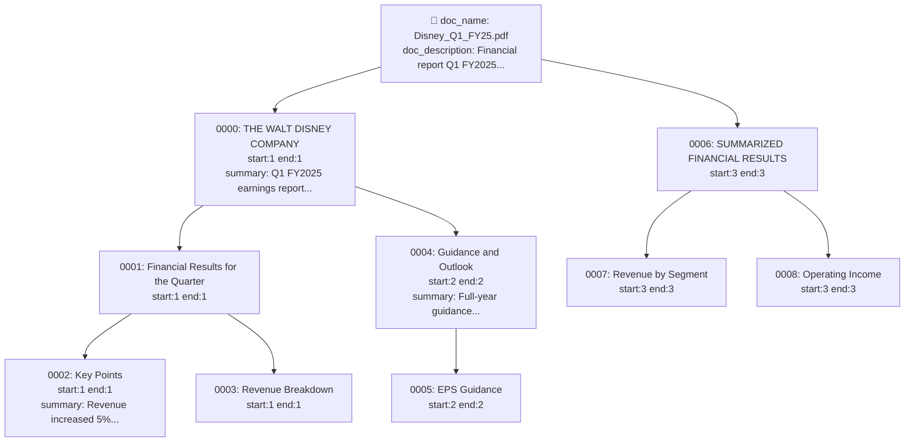

### Contoh Output (dari test: Disney Q1 FY25 Earnings)

```json
{
  "doc_name": "q1-fy25-earnings.pdf",
  "doc_description": "A comprehensive financial report detailing The Walt Disney Company's first-quarter fiscal 2025 performance...",
  "structure": [
    {
      "title": "THE WALT DISNEY COMPANY REPORTS FIRST QUARTER EARNINGS FOR FISCAL 2025",
      "node_id": "0000",
      "start_index": 1,
      "end_index": 1,
      "summary": "The partial document is a report from The Walt Disney Company...",
      "nodes": [
        {
          "title": "Financial Results for the Quarter",
          "node_id": "0001",
          "start_index": 1,
          "end_index": 1,
          "summary": "...",
          "nodes": [
            {
              "title": "Key Points",
              "node_id": "0002",
              "start_index": 1,
              "end_index": 1,
              "summary": "Revenue increased by 5% to $24.7 billion..."
            }
          ]
        },
        {
          "title": "Guidance and Outlook",
          "node_id": "0003",
          "start_index": 2,
          "end_index": 2,
          "summary": "...",
          "nodes": [...]
        }
      ]
    },
    {
      "title": "SUMMARIZED FINANCIAL RESULTS",
      "node_id": "0008",
      "start_index": 3,
      "end_index": 3,
      "summary": "...",
      "nodes": [...]
    }
  ]
}
```

### Properti per Node

| Field | Tipe | Deskripsi |
|-------|------|-----------|
| `title` | string | Judul section (dari TOC atau LLM-extracted) |
| `node_id` | string | ID unik, DFS sequential ("0000", "0001", ...) |
| `start_index` | int | Physical page number awal section |
| `end_index` | int | Physical page number akhir section |
| `summary` | string | LLM-generated summary konten node |
| `nodes` | array? | Child nodes (absent jika leaf node) |
| `text` | string? | Raw text (hanya jika `if_add_node_text: "yes"`) |

---

---

## 7.5 Semua LLM Prompts yang Digunakan

Ini adalah kompilasi lengkap semua prompt yang digunakan PageIndex (dari `page_index.py` dan `utils.py`):

### P1: TOC Detection per Halaman (`toc_detector_single_page`)

```
Your job is to detect if there is a table of content provided in the given text.

Given text: {content}

return the following JSON format:
{
    "thinking": <why do you think there is a table of content in the given text>
    "toc_detected": "<yes or no>",
}

Directly return the final JSON structure. Do not output anything else.
Please note: abstract, summary, notation list, figure list, table list, etc. are not table of contents.
```

### P2: TOC Completeness Check (`check_if_toc_transformation_is_complete`)

```
You are given a raw table of contents and a table of contents.
Your job is to check if the table of contents is complete.

Reply format:
{
    "thinking": <why do you think the cleaned table of contents is complete or not>
    "completed": "yes" or "no"
}
Directly return the final JSON structure. Do not output anything else.

Raw Table of contents: {content}
Cleaned Table of contents: {toc}
```

### P3: TOC Transformation (`toc_transformer`)

```
You are given a table of contents. Your job is to transform the whole table of content into a JSON format.

structure is the numeric system which represents the index of the hierarchy section.
For example: first section = "1", first subsection = "1.1", second subsection = "1.2", etc.

The response should be in the following JSON format:
{
    table_of_contents: [
        {
            "structure": <"x.x.x" or None>,
            "title": <title of the section>,
            "page": <page number or None>,
        },
        ...
    ],
}
You should transform the full table of contents in one go.
Directly return the final JSON structure, do not output anything else.

Given table of contents: {toc_content}
```

### P4: Physical Index Extraction (`toc_index_extractor`)

```
You are given a table of contents in a json format and several pages of a document.
Your job is to add the physical_index to the table of contents in the json format.

The provided pages contains tags like <physical_index_X> and <physical_index_X> to indicate
the physical location of the page X.

The response should be in the following JSON format:
[
    {
        "structure": <"x.x.x" or None>,
        "title": <title of the section>,
        "physical_index": "<physical_index_X>" (keep the format)
    },
    ...
]

Only add the physical_index to sections that are in the provided pages.
If the section is not in the provided pages, do not add physical_index.
Directly return the final JSON structure. Do not output anything else.

Table of contents: {toc}
Document pages: {content}
```

### P5: Add Page Number to TOC (`add_page_number_to_toc`)

```
You are given a JSON structure of a document and a partial part of the document.
Your task is to check if the title that is described in the structure is started in the partial given document.

The provided text contains tags like <physical_index_X> to indicate the physical location of page X.

If the full target section starts in the partial given document, insert "start": "yes",
"start_index": "<physical_index_X>".
If not, insert "start": "no", "start_index": None.

The response should be in the following format:
[
    {
        "structure": <"x.x.x" or None>,
        "title": <title of the section>,
        "start": "<yes or no>",
        "physical_index": "<physical_index_X>" or None
    },
    ...
]
The given structure contains the result of the previous part, you need to fill the result
of the current part, do not change the previous result.
Directly return the final JSON structure. Do not output anything else.

Current Partial Document: {part}
Given Structure: {structure}
```

### P6: Structure Extraction Init (`generate_toc_init`)

```
You are an expert in extracting hierarchical tree structure, your task is to generate
the tree structure of the document.

The structure variable is the numeric system which represents the index of the hierarchy section.
For example: first = "1", first sub = "1.1", second sub = "1.2", etc.

For the title, you need to extract the original title from the text, only fix space inconsistency.

The provided text contains tags like <physical_index_X> to indicate the start and end of page X.

For the physical_index, you need to extract the physical index of the start of the section.
Keep the <physical_index_X> format.

The response should be in the following format:
[
    {
        "structure": <"x.x.x">,
        "title": <title, keep original>,
        "physical_index": "<physical_index_X> (keep the format)"
    },
],

Directly return the final JSON structure. Do not output anything else.

Given text: {part}
```

### P7: Structure Extraction Continue (`generate_toc_continue`)

```
You are an expert in extracting hierarchical tree structure.
You are given a tree structure of the previous part and the text of the current part.
Your task is to continue the tree structure from the previous part to include the current part.

[Same format as P6...]

Directly return the ADDITIONAL part of the final JSON structure. Do not output anything else.

Given text: {part}
Previous tree structure: {toc_content}
```

### P8: Title Appearance Check (`check_title_appearance`)

```
Your job is to check if the given section appears or starts in the given page_text.

Note: do fuzzy matching, ignore any space inconsistency in the page_text.

The given section title is {title}.
The given page_text is {page_text}.

Reply format:
{
    "thinking": <why do you think the section appears or starts in the page_text>
    "answer": "yes or no"
}
Directly return the final JSON structure. Do not output anything else.
```

### P9: Title at Beginning Check (`check_title_appearance_in_start`)

```
You will be given the current section title and the current page_text.
Your job is to check if the current section starts in the BEGINNING of the given page_text.
If there are other contents before the current section title, it does not start at the beginning.
If the current section title is the FIRST content in the given page_text, it starts at the beginning.

Note: do fuzzy matching, ignore any space inconsistency.

The given section title is {title}.
The given page_text is {page_text}.

reply format:
{
    "thinking": <...>
    "start_begin": "yes or no"
}
Directly return the final JSON structure. Do not output anything else.
```

### P10: Fix Incorrect TOC Entry (`single_toc_item_index_fixer`)

```
You are given a section title and several pages of a document.
Your job is to find the physical index of the start page of the section.

The provided pages contains tags like <physical_index_X> to indicate the physical location of page X.

Reply in a JSON format:
{
    "thinking": <explain which page contains the start of this section>,
    "physical_index": "<physical_index_X>" (keep the format)
}
Directly return the final JSON structure. Do not output anything else.

Section Title: {section_title}
Document pages: {content}
```

### P11: Node Summary (`generate_node_summary`)

```
You are given a part of a document, your task is to generate a description of the partial
document about what are main points covered in the partial document.

Partial Document Text: {node['text']}

Directly return the description, do not include any other text.
```

### P12: Document Description (`generate_doc_description`)

```
You are an expert in generating descriptions for a document.
You are given a structure of a document. Your task is to generate a one-sentence description
for the document, which makes it easy to distinguish the document from other documents.

Document Structure: {structure}

Directly return the description, do not include any other text.
```

### P13: Tree Search (`tutorials/tree-search/README.md`)

```python
prompt = f"""
You are given a query and the tree structure of a document.
You need to find all nodes that are likely to contain the answer.

Query: {query}
Document tree structure: {PageIndex_Tree}

Reply in the following JSON format:
{{
  "thinking": <your reasoning about which nodes are relevant>,
  "node_list": [node_id1, node_id2, ...]
}}
"""
```

---

## 8. Jumlah LLM Calls di Indexing

Ini penting untuk memahami **biaya** PageIndex. Estimasi LLM calls untuk 1 dokumen:

| Tahap | Jumlah Calls | Sifat |
|-------|-------------|-------|
| TOC detection (scan 20 halaman) | ~20 calls | Sequential per halaman |
| TOC page extraction | 1 call | - |
| TOC completeness check | 1-5 calls | Iterative sampai complete |
| TOC to JSON transformation | 1-5 calls | Iterative sampai complete |
| Page index detection | 1 call | - |
| Physical index extraction | 1 call | - |
| Verify TOC (all entries) | N calls | Concurrent (N = jumlah entries) |
| Fix incorrect entries | M × 2 calls | M = jumlah salah, × verifikasi |
| Start appearance check | N calls | Concurrent |
| Large node subdivision | Variable | Recursive |
| Summary generation | N calls | Concurrent (semua nodes) |
| Doc description | 1 call | - |
| **Total estimasi** | **~50-200+ calls** | Tergantung ukuran dokumen |

Ini menjadikan indexing **mahal** untuk dokumen besar. Namun indexing hanya dilakukan sekali per dokumen.

---

## 9. Utility Functions Penting

### PDF Processing

| Fungsi | Deskripsi |
|--------|-----------|
| `get_page_tokens(pdf_path)` | PDF → `[(text, token_count)]` per halaman |
| `get_text_of_pages(pdf_path, start, end)` | Ambil teks halaman start-end dengan `<start_index_X>` tags |
| `get_text_of_pdf_pages_with_labels(pages, start, end)` | Sama tapi dari page list, dengan `<physical_index_X>` tags |

### Tree Operations

| Fungsi | Deskripsi |
|--------|-----------|
| `list_to_tree(data)` | Flat list `[{structure: "1.2.3"}]` → nested tree |
| `get_nodes(structure)` | Flatten tree → list semua nodes |
| `get_leaf_nodes(structure)` | Ambil leaf nodes saja |
| `is_leaf_node(data, node_id)` | Cek apakah node adalah leaf |
| `structure_to_list(structure)` | Tree → ordered flat list (termasuk parent) |
| `write_node_id(data)` | Assign sequential node_id via DFS |

### JSON/LLM Helpers

| Fungsi | Deskripsi |
|--------|-----------|
| `extract_json(content)` | Parse JSON dari response LLM (handle ```json``` blocks, trailing commas, dll) |
| `ChatGPT_API(model, prompt)` | Sync OpenAI API call, retry 10x |
| `ChatGPT_API_async(model, prompt)` | Async version |
| `ChatGPT_API_with_finish_reason(model, prompt)` | Return `(content, finish_reason)` — penting untuk detect max_output |
| `count_tokens(text, model)` | Hitung jumlah token via tiktoken |

### Page Grouping

```python
page_list_to_group_text(page_contents, token_lengths, max_tokens=20000, overlap_page=1)
```
Membagi halaman menjadi groups yang masing-masing ≤ `max_tokens`, dengan overlap 1 halaman antar group.

---

## 10. Markdown Support (`page_index_md.py`)

PageIndex juga mendukung indexing file Markdown:

1. Parse header Markdown (`#`, `##`, `###`, ...) → hierarchy level
2. Ekstrak teks per section (dari header ke header berikutnya)
3. Build tree berdasarkan header levels
4. **Tree thinning** (optional) — gabungkan node kecil (<5000 tokens) dengan parent
5. Generate summary per node

Tidak menggunakan LLM untuk parsing — murni regex-based karena Markdown punya struktur eksplisit (`#` = level).

**Catatan**: Mirip dengan pendekatan `prototype_parser.py` untuk UU Indonesia — karena strukturnya sudah eksplisit (BAB > Pasal), tidak perlu LLM untuk indexing.

---

## 11. Relevansi untuk Skripsi

### Apa yang Bisa Diadaptasi Langsung

| Komponen PageIndex | Adaptasi |
|-------------------|----------|
| Tree structure output format | Format JSON tree bisa dipakai langsung, ganti `start_index`/`end_index` (page) dengan referensi Pasal/Ayat |
| `node_id` system | Bisa dipakai, atau ganti dengan meaningful path (e.g. `bab-1/pasal-5`) |
| Summary generation per node | Setiap BAB/Pasal butuh summary untuk tree search |
| Doc description | Setiap UU butuh deskripsi untuk doc-level selection |
| Tree search prompt pattern | Inti retrieval — adaptasi langsung |
| Multi-doc search by metadata | Sangat cocok — UU punya metadata rich (nomor, tahun, judul, subjek, relasi) |
| Multi-doc search by description | Cocok sebagai fallback |
| `list_to_tree()` logic | Bisa dipakai untuk convert flat Pasal list → nested tree |

### Apa yang TIDAK Perlu Diadaptasi

| Komponen PageIndex | Alasan Skip |
|-------------------|-------------|
| 3-mode adaptive TOC detection | UU Indonesia punya format konsisten → regex cukup |
| LLM-based TOC extraction | Struktur UU deterministik per UU No. 12/2011 |
| Verification & self-correction | Regex parsing sudah akurat, tidak perlu LLM verifikasi |
| Page offset calculation | Tidak relevan — kita index per Pasal, bukan per halaman |
| `process_large_node_recursively` | Mungkin tidak perlu — Pasal biasanya pendek |
| Preface handling | UU selalu mulai dari BAB I (Ketentuan Umum) |

### Keunggulan Pendekatan Skripsi vs PageIndex Asli

1. **Efisiensi biaya drastis** — PageIndex menghabiskan ~80% LLM budget untuk indexing. Karena UU punya format konsisten, indexing kita regex-based = **hampir zero LLM cost untuk indexing**.

2. **Akurasi indexing lebih tinggi** — PageIndex rentan error karena LLM bisa salah deteksi TOC/page mapping. Regex-based parsing pada format UU yang konsisten → **deterministic, 100% reproducible**.

3. **Fokus LLM ke retrieval** — Semua LLM budget bisa difokuskan ke reasoning-based retrieval, yang justru lebih penting untuk menjawab pertanyaan hukum.

4. **Metadata-rich** — UU punya metadata terstruktur (subjek, relasi antar-UU, status berlaku/dicabut) yang tidak dimiliki generic PDF. Ini memungkinkan **doc-level routing yang lebih presisi**.

5. **Hierarki yang diketahui** — UU No. 12/2011 mendefinisikan hierarki yang pasti:
   ```
   UU > PP > Perpres  (antar dokumen)
   BAB > Bagian > Paragraf > Pasal > Ayat  (dalam dokumen)
   ```
   PageIndex harus menebak hierarki — kita sudah tahu.

### Peta Konsep: PageIndex → Skripsi

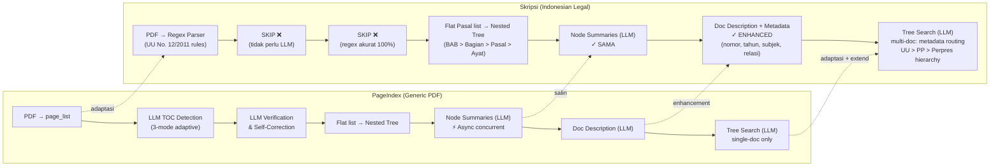

---

## 12. Catatan Teknis Tambahan

### Concurrency Model

PageIndex menggunakan `asyncio` untuk concurrency:
- Verifikasi TOC, summary generation, dan fix incorrect items berjalan concurrent via `asyncio.gather()`
- LLM API calls di-batch secara async — ini mempercepat processing dokumen besar
- `ThreadPoolExecutor` juga tersedia tapi tidak banyak dipakai di kode saat ini

### Error Handling

- LLM API calls di-retry max 10x dengan 1 detik delay
- Jika JSON parsing gagal, ada cascade cleanup: remove trailing commas, normalize whitespace
- `finish_reason == "max_output_reached"` → auto-continue: kirim prompt lanjutan untuk generate sisa output
- Physical index yang melebihi jumlah halaman dokumen di-truncate/remove

### Token Management

- Dokumen dipecah jadi groups ≤ 20K tokens (configurable via `max_token_num_each_node`)
- Overlap 1 halaman antar group untuk menjaga konteks
- Token counting via tiktoken (model-specific encoding)

### Logging

- `JsonLogger` menyimpan semua intermediate states ke file JSON
- Berguna untuk debugging tapi menghasilkan file log besar
- Format: `{pdf_name}_{timestamp}.json`

---

---

## 13.5 Perbandingan Tiga Pendekatan RAG

```mermaid
flowchart TD
    subgraph VR["Vector RAG (Baseline)"]
        VR1["📄 PDF → Chunking\n(fixed-size, e.g. 512 tokens)"]
        VR2["🔢 Embedding per chunk\n(model: text-embedding-3)"]
        VR3["🗄️ Vector DB (Pinecone, etc.)"]
        VR4["❓ Query → Embedding"]
        VR5["📊 Top-K cosine similarity"]
        VR6["💬 Answer with retrieved chunks"]
        VR1 --> VR2 --> VR3
        VR4 --> VR5 --> VR6
    end

    subgraph PI["PageIndex (Reference)"]
        PI1["📄 PDF → LLM extracts\nhierarchical TOC"]
        PI2["🌲 Tree JSON\n(node_id, summary, page refs)"]
        PI3["❓ Query + Full Tree → LLM"]
        PI4["🎯 node_list: [0003, 0007]"]
        PI5["📖 Fetch pages start→end"]
        PI6["💬 Answer with page sections"]
        PI1 --> PI2
        PI3 --> PI4 --> PI5 --> PI6
    end

    subgraph SK["Skripsi Approach"]
        SK1["📄 PDF → Regex Parser\n(deterministic, UU No. 12/2011)"]
        SK2["🌲 Pasal Tree JSON\n(BAB/Pasal/Ayat + metadata UU)"]
        SK3["❓ Query + Metadata → doc routing\nLLM tree search in target docs"]
        SK4["🎯 pasal_list: [UU8/2023 Pasal 24]"]
        SK5["📖 Fetch Pasal text"]
        SK6["💬 Answer + Reasoning Path\n(traceable ke Pasal & UU level)"]
        SK1 --> SK2
        SK3 --> SK4 --> SK5 --> SK6
    end
```

| Aspek | Vector RAG | PageIndex | Skripsi |
|-------|-----------|-----------|---------|
| **Indexing method** | Embedding + chunking | LLM TOC extraction | Regex parser (deterministic) |
| **Indexing cost** | Low (embedding API) | High (~50-200 LLM calls/doc) | Very Low (~zero LLM) |
| **Retrieval method** | Top-K cosine similarity | LLM tree search | LLM tree search + metadata routing |
| **Explainability** | Low (similarity scores) | Medium (node path) | High (BAB/Pasal/Ayat + doc hierarchy) |
| **Legal accuracy** | Low (semantic ≠ relevant) | High (structure-aware) | Very High (exact Pasal match) |
| **Cross-doc links** | No | No | Yes (UU > PP > Perpres) |
| **Domain metadata** | No | No (generic) | Yes (nomor, tahun, subjek, relasi) |
| **Infrastructure** | Vector DB required | JSON only | JSON + metadata (SQL/catalog) |
| **Reproducibility** | Low (embedding varies) | Medium (LLM varies) | High (regex deterministic) |

---

## 13. Referensi Terkait

- **Paper/Blog**: [PageIndex Framework Introduction](https://pageindex.ai/blog/pageindex-intro)
- **FinanceBench result**: [Mafin2.5](https://github.com/VectifyAI/Mafin2.5-FinanceBench) — 98.7% accuracy
- **MCTS**: Monte Carlo Tree Search — teknik dari game AI (AlphaGo) yang diadaptasi untuk document retrieval
- **UU No. 12/2011**: Undang-Undang tentang Pembentukan Peraturan Perundang-undangan — mendefinisikan format dan hierarki regulasi Indonesia
